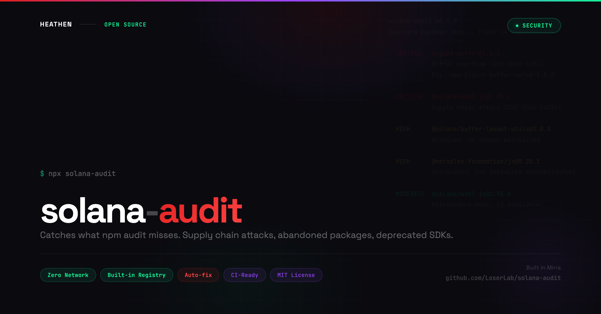

# solana-audit

<p align="center">
  
</p>

Solana-specific dependency auditor. Catches abandoned packages, archived repos, deprecated APIs, and known malicious packages that `npm audit` misses.

Zero network requests. Built-in registry. Instant results.

## Install

```bash
npx solana-audit
```

Or install globally:

```bash
npm install -g solana-audit
solana-audit
```

## What it catches

`npm audit` only flags CVEs. `solana-audit` also catches:

- **Compromised versions** (e.g., @solana/web3.js 1.95.6-1.95.7 supply chain attack)
- **Abandoned packages** (e.g., bigint-buffer, @solana/buffer-layout-utils)
- **Deprecated SDKs** (e.g., @metaplex-foundation/js, @project-serum/*)
- **Superseded frameworks** (e.g., @solana/web3.js v1 → @solana/kit)
- **Known malicious packages** (e.g., solana-systemprogram-utils typosquatting)

### Full Registry

| Severity | Package | Issue | Fix |
|---|---|---|---|
| CRITICAL | @solana/web3.js 1.95.6-1.95.7 | Supply chain attack (CVE-2024-54134) | Upgrade to >=1.95.8 |
| CRITICAL | bigint-buffer | Buffer overflow (CVE-2025-3194) | Use bigint-buffer-safe |
| CRITICAL | elliptic <=6.6.1 | Private key extraction (CVE-2025-14505) | Use @noble/curves |
| CRITICAL | solana-systemprogram-utils | Malicious fee skimming | Remove |
| HIGH | @solana/buffer-layout-utils | Archived Jan 2025 | Migrate to @solana/kit |
| HIGH | @metaplex-foundation/js | Deprecated, archived | Use @metaplex-foundation/umi |
| HIGH | @project-serum/* | Abandoned org | Use @coral-xyz/* |
| MODERATE | @solana/web3.js v1.x | Maintenance mode | Migrate to @solana/kit |
| INFO | @solana/wallet-adapter-* | Superseded | Use @solana/connector |

## Usage

```bash
# Scan current directory
npx solana-audit

# Scan specific project
npx solana-audit ./my-project

# JSON output (for CI/CD)
npx solana-audit --json

# Only show critical and high severity
npx solana-audit --severity high

# Auto-fix (adds overrides to package.json)
npx solana-audit --fix
```

## Example Output

```
solana-audit v0.1.0

Scanning package.json... Found 14 dependencies (8 direct, 6 transitive)

  CRITICAL  bigint-buffer@1.1.5
            Buffer overflow in toBigIntLE() (CVE-2025-3194)
            Fix: Add override: "bigint-buffer": "npm:bigint-buffer-safe@^1.0.0"

  HIGH      @solana/buffer-layout-utils@2.0.0
            Package archived, no longer maintained
            Fix: Migrate to @solana/kit which does not depend on this package.

  MODERATE  @solana/web3.js@1.95.8
            Maintenance mode, v2 available
            Fix: Migrate to @solana/kit. Use npx solana-codemod ./src to automate the migration.

3 issues found (1 critical, 1 high, 1 moderate)
```

## Exit Codes

| Code | Meaning |
|---|---|
| 0 | No issues found |
| 1 | High or moderate issues found |
| 2 | Critical issues found |

Use exit codes in CI pipelines to block deploys with critical vulnerabilities.

## Auto-fix

The `--fix` flag automatically adds package manager overrides for fixable issues:

```bash
npx solana-audit --fix
```

Detects your package manager (npm, yarn, pnpm) and adds the correct override format.

## Part of the Solana Migration Toolkit

Four tools that work together to get your project from web3.js v1 to Kit v2:

| Tool | What it does |
|------|-------------|
| [solana-deps](https://github.com/LoserLab/solana-deps) | Trace why legacy packages are in your tree |
| **solana-audit** (this tool) | Catch CVEs and deprecated APIs that `npm audit` misses |
| [solana-codemod](https://github.com/LoserLab/solana-codemod) | Auto-migrate code from web3.js v1 to Kit v2 |
| [bigint-buffer-safe](https://github.com/LoserLab/bigint-buffer-safe) | Drop-in CVE fix for bigint-buffer |

**Recommended workflow:** `solana-deps` (find what's legacy) -> `solana-audit` (check for vulnerabilities) -> `solana-codemod` (fix the code) -> `solana-audit` (verify the result).

## Author

Created by **Heathen**

Built in [Mirra](https://mirra.app)

## License

MIT License

Copyright (c) 2026 Heathen
